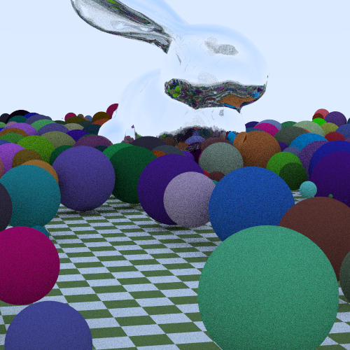

# PBRenderer



- This is physically based renderer for learning rendering algorithms, which include global illuminations, effective techniques (i.e., Next Event Estimation, Bounding Volume Hierarchy, etc...), several integrators (i.e., MLT, Bidirectional path tracing), several sampling strategy.
- If finished basic learning of path tracing, I would like to implement GPU path tracing techniques using OptiX or CUDA.

## TODO:
- [x] Divide material and shape for effectively render the scene.
  - I have to be referring to PBRT implementation of primitive. It is worthless to store the material for each triangle, so I want to reuse these materials for same triangle meshes. 
  - Maybe, the abstract implementation is as follows.
```c++
class Material { ... };
class Shape { ... };
class Primitive {
    Material m; 
    Shape s;
};
```

- [ ] Add Russian roulette 
- [ ] Add Emitter 
- [ ] Implement several sampling strategy
- [ ] Create **Disney Principled BSDF** Class for material.
- [ ] Implement Image I/O ... **now implementing**
  - [x] Base Image class (only constructor)
  - [ ] Write image to file
- [ ] Transformation system (translate, rotate, scale)